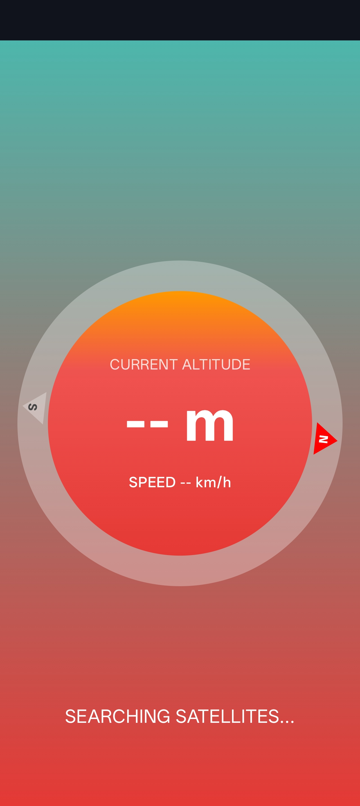
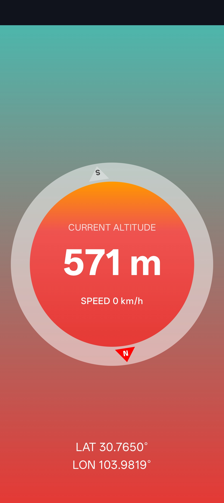

# Altitude 🏔️

A beautiful, real-time altitude and compass application for Android, built with Jetpack Compose. It features a sleek, modern interface and provides highly accurate data using native hardware sensors.

## Preview

|        Searching for Satellites         |        Real-time Data Locked        |
| :-------------------------------------: | :---------------------------------: |
|  |  |

## Features

- **Real-time Altitude:** Uses native hardware GPS for highly accurate altitude data (requires clear sky visibility).
- **Smooth Compass:** Utilizes raw accelerometer and magnetometer sensors for a zero-delay, high-refresh-rate compass experience.
- **Modern UI:** Built entirely with Jetpack Compose featuring custom Canvas drawing, sunrise gradients, and dynamic responsive layouts.
- **Privacy First:** All calculations are performed locally on the device without requiring network data.

## Requirements

- Android 7.0 (API level 24) or higher.
- Device with GPS, Accelerometer, and Magnetometer sensors.

## Installation

1. Go to the [Releases](https://github.com/Jaanai-Liu/altitude/releases) page.
2. Download the latest `Altitude-v1.0.apk`.
3. Install it on your Android device (allow "Install from unknown sources" if prompted).

## License

This project is licensed under the MIT License.

---

# 实时高度表 (Altitude) 🏔️

这是一个精美的实时海拔与指南针安卓应用，基于 Jetpack Compose 开发。它拥有极具现代感的简约界面，并通过调用手机原生硬件传感器为你提供高精度的测量数据。

## 软件预览

|             正在搜索卫星             |           数据获取成功           |
| :----------------------------------: | :------------------------------: |
|  |  |

## 功能特性

- **实时海拔：** 调用原生 GPS 硬件获取高精度海拔数据（需在户外空旷环境下使用）。
- **丝滑指南针：** 结合加速度计与地磁传感器，提供零延迟、高刷新率的指南针交互体验。
- **现代 UI：** 完全使用 Jetpack Compose 构建，包含自定义 Canvas 绘图、日出渐变色彩及动态响应式布局。
- **隐私第一：** 所有计算均在本地完成，无需连接网络。

## 硬件要求

- Android 7.0 (API 级别 24) 或更高版本。
- 设备需内置 GPS、加速度计及地磁传感器。

## 安装指南

1. 访问 [Releases](https://github.com/Jaanai-Liu/altitude/releases) 页面。
2. 下载最新的 `Altitude-v1.0.apk` 文件。
3. 在安卓设备上点击安装（如遇提示，请允许“安装未知来源应用”）。

## 开源协议

本项目采用 MIT 开源协议。
